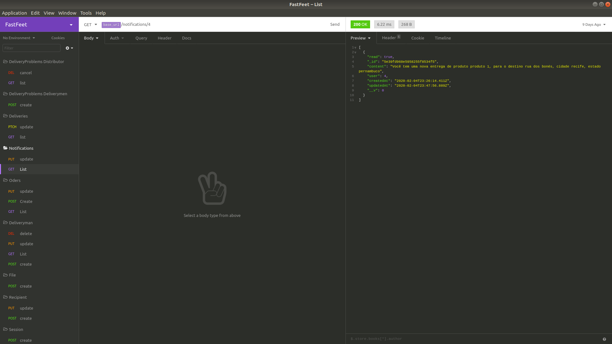
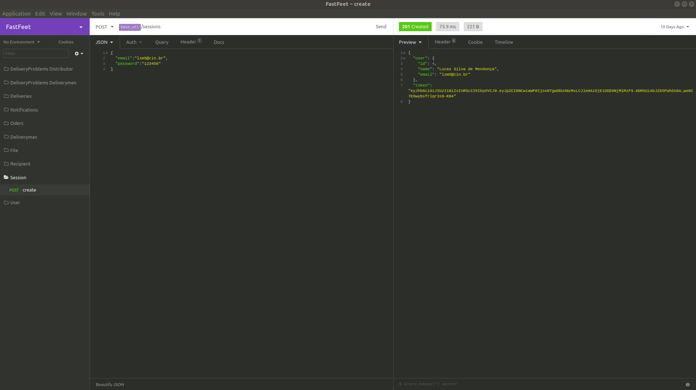
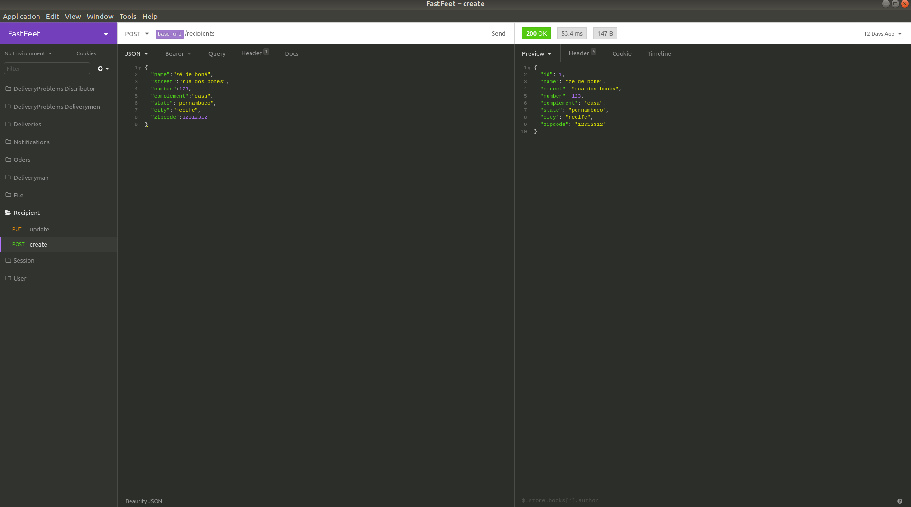
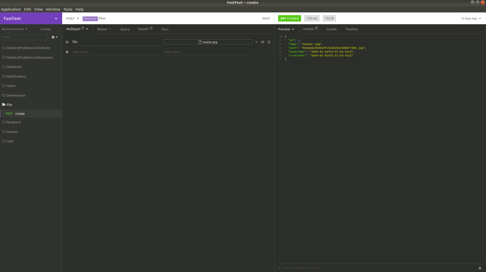

# FastFeet

<h1 align="center">
    
</h1>

<h4 align="center">
 Software completo para empresa de transporte 🚚
</h4>

<p align="center">
  
  
  
  
  
  

  

  

  

</p>

## Infomações

- [Software Web](#software-web)

  - [Como usar](#como-usar-para-web)
  - [Screenshots](#screenshots-web)

- [Software Mobile](#software-mobile)

  - [Como usar](#como-usar-para-mobile)
  - [Screenshots](#screenshots-mobile)

- [Servidor](#como-usar-o-servidor)

  - [Como usar](#como-usar-o-servidor)
  - [Importe as rotas para seu Insomnia](#baixe-todas-as-rotas-insomnia)
  - [Screenshots](#screenshots-servidor)

- [Tecnologias](#tecnologias)

## Software Web

### Como usar para web

```bash
# Clone este repositório
$ git clone https://github.com/lsm-5/FastFeet.git

# Vá para a seguinte pasta

$ cd FrontWeb

# Instale as depedências

$ yarn install

# Inicialize o software

$ yarn start

```

### Screenshots web

## Software mobile

### Como usar para mobile

```bash
# Clone este repositório
$ git clone https://github.com/lsm-5/FastFeet.git

# Vá para a seguinte pasta
$ cd FrontMobile

# Instale as depedências
$ yarn install

# Inicialize o software (android ou ios)
$ react-native run-android
$ react-native run-ios
```

### Screenshots mobile

## Servidor

### Como usar o servidor

```bash
# Clone este repositório
$ git clone https://github.com/lsm-5/FastFeet.git

# Vá para a seguinte pasta
$ cd Server

# Instale as depedências
$ yarn install

# Inicializar as migrations e as seeds
yarn sequelize db:migrate
yarn sequelize db:seed:all

# Inicialize o software (android ou ios)
$ yarn dev
```

configure as variáveis ambiente, seguindo o modelo do arquivo `.env.example`.

### Baixe todas as rotas (Insomnia)

[](https://insomnia.rest/run/?label=FasfFeet%20API&uri=https%3A%2F%2Fraw.githubusercontent.com%2Flsm-5%2FFastFeet%2Fmaster%2FServer%2FInsomniaExport.json)

### Screenshots servidor

<p align="center">
  
  
  
  
  
  

  

</p>

## Tecnologias

Este projeto foi desenvolvido baseado nas atividades da [RocketSeat GoStack Bootcamp](https://rocketseat.com.br/bootcamp) com as seguintes tecnologias:

- [Axios](https://github.com/axios/axios)
- [Docker](https://www.docker.com/)
- [Node.js](https://github.com/nodejs)
- [Express](https://github.com/expressjs/express)
- [Sequelize](https://github.com/sequelize/sequelize)
- [JWT](https://www.npmjs.com/package/jsonwebtoken)
- [Bcryptjs](https://www.npmjs.com/package/bcrypt)
- [DotEnv](https://github.com/motdotla/dotenv)
- [Nodemailer](https://github.com/nodemailer/nodemailer)
- [Handlebars](https://handlebarsjs.com/)
- [Bee-Queue](https://github.com/bee-queue/bee-queue)
- [Date-fns](https://github.com/date-fns/date-fns)
- [VS Code][vc] com [EditorConfig][vceditconfig] e [ESLint][vceslint]
- [Yup](https://www.npmjs.com/package/yup)
- [Sentry](https://sentry.io/)
- [Youch](https://github.com/poppinss/youch)

### Bancos de dados da aplicacão

- [Postegres](https://github.com/postgres/postgres)
- [MongoDB](https://www.mongodb.com/)
- [Redis](https://redis.io/)

### Ferramentas utilizadas no ambiente de desenvolvimento:

- [Sucrase](https://sucrase.io/)
- [ESLint](https://github.com/eslint/eslint)
- [Prettier](https://github.com/prettier/prettier)

Feito com ♥ por Lucas Mendonça // [LinkedIn](https://www.linkedin.com/in/lucas-mendon%C3%A7a-12181a187/)

[nodejs]: https://nodejs.org/
[yarn]: https://yarnpkg.com/
[vc]: https://code.visualstudio.com/
[vceditconfig]: https://marketplace.visualstudio.com/items?itemName=EditorConfig.EditorConfig
[vceslint]: https://marketplace.visualstudio.com/items?itemName=dbaeumer.vscode-eslint
